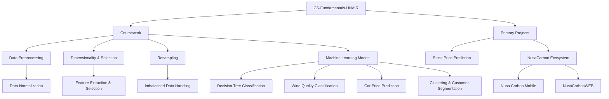

# CS-Fundamentals-UNAIR

📚 **Academic Projects & Development Portfolio** — Information Systems, Universitas Airlangga (UNAIR)
  

This repository serves as an academic portfolio showcasing various computer science, data science, and software development projects completed during the Information Systems course at **Universitas Airlangga**. The repository is categorized into structured coursework assignments and primary full-scale projects.

---

## 🗺️ Repository Map

---

## 📂 Coursework Portfolio

The list below outlines data preprocessing tasks, statistical modeling, and interactive dashboards created for coursework requirements:

| Area | Folder Name | Topics & Methods | Short Description |
|---|---|---|---|
| **Data Preprocessing** | [`Data Normalization`](./Data%20Normalization) | Min-Max, Z-Score Standard, Robust Scaling | Performs data scaling and normalization on Lung Cancer and Shopping Mall datasets to prevent numerical scale bias. |
| **Statistical Analysis** | [`Feature Extraction & Selection`](./Feature%20Extraction%20%26%20Selection) | Principal Component Analysis (PCA), ANOVA | Reduces dimensionality with PCA (95% variance threshold) and evaluates relevant parameters with ANOVA statistical tests. |
| **Resampling** | [`Imbalanced Data Handling`](./Imbalanced%20Data%20Handling) | Random Oversampling (ROS), Random Undersampling (RUS) | Addresses target class imbalance issues on the Wine Quality dataset using `imbalanced-learn`. |
| **Machine Learning** | [`Decision Tree Classification`](./Decision%20Tree%20Classification) | Gini & Entropy Decision Tree Classifier | Builds tree models for medical patient classification, including high-res visualizations of the top 3 split levels. |
| **Interactive Dashboard** | [`Wine Quality Classification`](./Wine%20Quality%20Classification) | Streamlit Web App, Plotly charts | Features an interactive Streamlit app to analyze chemical properties of wine and predict quality tags in real-time. |
| **Regression & Ensemble** | [`Car Price Prediction`](./Car%20Price%20Prediction) | XGBoost, LightGBM Regressor | Evaluates and compares ensemble regression models to predict used car pricing with high accuracy. |
| **Unsupervised Learning** | [`Clustering & Customer Segmentation`](./Clustering%20%26%20Customer%20Segmentation) | K-Means & K-Modes Clustering | Implements demographic customer grouping and credit card usage segmentation utilizing Elbow and Silhouette evaluation. |

---

## 🚀 Primary Projects Showcase

This section highlights full-scale development projects integrating various engineering domains:

### 1. NusaCarbon Ecosystem (Mobile & Web)
A digital marketplace platform for trading carbon credit tokens and executing dMRV (digital Measurement, Reporting, and Verification) workflows.
*   **[`Nusa Carbon Mobile`](./Nusa%20Carbon%20Mobile)**: A **Flutter** mobile client for buyers and project owners. Displays portfolio metrics, hosts dMRV upload forms, and simulates real-time blockchain transaction state updates.
*   **[`NusaCarbonWEB`](./Nusa%20Carbon%20WEB)**: A **PHP** web portal featuring role-based dashboards for Buyers, Project Owners, and Verifiers. Formatted to build and run easily in local containerized environments using Docker.

### 2. [`Stock Price Prediction (GA + RF)`](./Stock%20Price%20Prediction%20\(GA%20%2B%20RF\))
A trading recommendation and model development pipeline designed to predict the price direction of BBCA (Bank Central Asia) stock using evolutionary AI.
*   **Genetic Algorithm (GA)**: Selects optimal combinations of technical indicators (RSI, MACD, Bollinger Bands, etc.) to prevent overfitting.
*   **Random Forest (RF)**: Serves as the core classifier predicting positive/negative price direction.
*   **Decision Threshold Tuning**: Tunes probability cutoffs to maximize Precision (minimizing losing trades) and control False Positives.
*   **Analytics**: Includes full log charts showing ROC-AUC curves, GA fitness history, ablation studies, and simulated profit results.

---

## 🛠️ Tech Stack Summary

The primary technologies utilized across all projects in this repository:

*   **Languages**: Python, Dart, PHP, JavaScript, SQL
*   **Machine Learning**: `scikit-learn`, `xgboost`, `lightgbm`, `imbalanced-learn`
*   **Data Analysis & Vis**: `pandas`, `numpy`, `matplotlib`, `seaborn`, `plotly`
*   **Mobile App Development**: `Flutter` (Dart)
*   **Web Frameworks**: `Streamlit`, Vanilla PHP (with modern CSS/Bootstrap UI elements)
*   **Infrastructure**: `Docker`, Local database configuration

---

## 👤 Author

**Muhammad Naufal Zaki**  
NIM: 187241115  
Information Systems  
Faculty of Science and Technology, Universitas Airlangga
